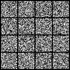
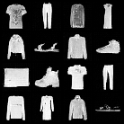

# Diffusion Transformer with Rectified Flow for Image Generation

<p align="center">
    
    
</div>

<br>

> 50 Epochs on FashionMNIST, 50 Sampling Steps, ~5 minutes on A100

I watched a [youtube video](https://www.youtube.com/watch?v=aSLDXdc2hkk) about [Scalable Diffusion Models with Transformers (DiT)](https://www.wpeebles.com/DiT) and was like "eh I need a side quest anyway."

My implementation supports training on CPU, MPS, and GPU, as well as distributed training across multiple GPUs. For those interested, there is also an option to train the model with EMA. I tried to make everything as modular and spelled-out as possible so that it's easy to understand/modify for people who are new to this stuff like I am. I currently don't use an autoencoder for latent diffusion, but this would be a cool next step.

This implementation is pretty heavily based on the [official DiT implementation](https://github.com/facebookresearch/DiT/tree/main), the [youtube video's implementation](https://github.com/explainingai-code/DiT-PyTorch/tree/main/), and [this implementation which pairs DiT with rectified flow](https://github.com/cloneofsimo/minRF/tree/main).

---

## Setup
download the repo:
```bash
git clone https://github.com/ozanbayiz/DiT_RF.git
cd DiT_RF
```

create the conda environment:
```bash
conda env create -f environment.yml
```

activate the environment:

```bash
conda activate DiT_RF
```

---

## Training

configure your `config.yml` file as desired, then run:
```bash
python train.py --config <path/to/your/config.yml>
```

for distributed training, run:
```bash
torchrun train.py --config <path/to/your/config.yml>
```

---

## Sampling

configure the `sampling` section in your `config.yml` as desired, then run:
```bash
python sample.py --config <path/to/your/config.yml>
```

---

## Citations
```bibtex
@misc{peebles2023scalablediffusionmodelstransformers,
    title={Scalable Diffusion Models with Transformers}, 
    author={William Peebles and Saining Xie},
    year={2023},
    eprint={2212.09748},
    archivePrefix={arXiv},
    primaryClass={cs.CV},
    url={https://arxiv.org/abs/2212.09748}, 
}
@misc{ryu2024minrf,
    author={Simo Ryu},
    title={minRF: Minimal Implementation of Scalable Rectified Flow Transformers},
    year={2024},
    publisher={Github},
    url={https://github.com/cloneofsimo/minRF},
}
```
Although he did not make a citation, the youtube video's repo can be found at
https://github.com/explainingai-code/DiT-PyTorch/tree/main/
